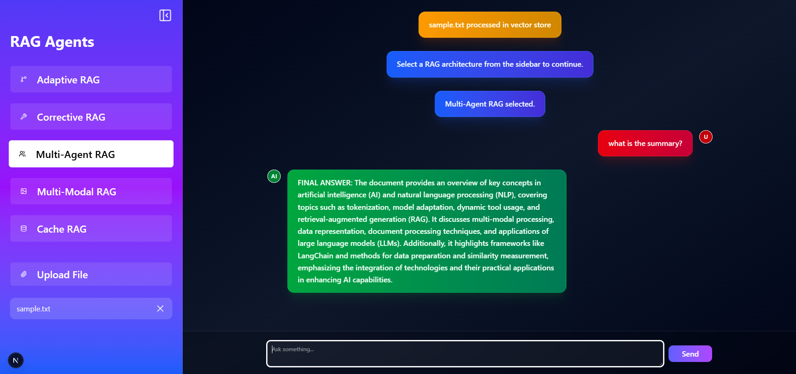
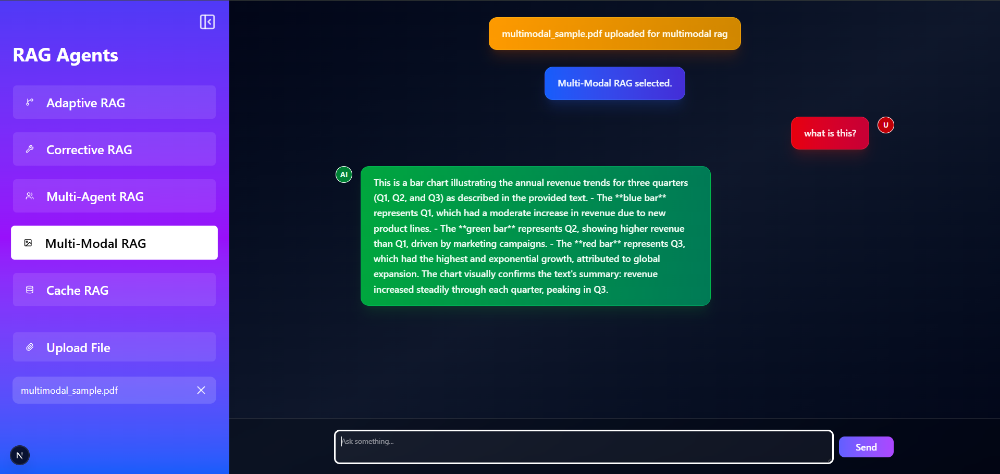
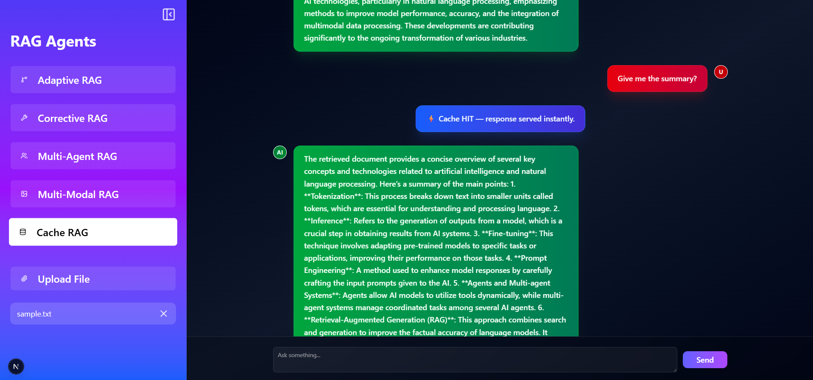

---

# RAG Agent Framework

## Table of Contents

- [Overview](#overview)
- [Vision](#vision)
- [Project Structure](#project-structure)
- [System Architecture](#system-architecture)
- [RAG Strategies Implemented](#rag-strategies-implemented)
- [Vector Store and Retrieval Pipeline](#vector-store-and-retrieval-pipeline)
- [Agent Orchestration](#agent-orchestration)
- [Frontend Interface](#frontend-interface)
- [File Upload and Knowledge Ingestion](#file-upload-and-knowledge-ingestion)
- [Tech Stack](#tech-stack)
- [System Design Considerations](#system-design-considerations)
- [Features](#features)
- [Future Improvements](#future-improvements)
- [License](#license)

---

# Overview

The **RAG Agent Framework** is a modular platform designed to experiment with and demonstrate different **Retrieval-Augmented Generation (RAG) architectures**.

The system combines:

- **FastAPI backend** for AI orchestration
- **Next.js frontend** for interactive user experience
- **LangChain and LangGraph** for agent workflows
- **Vector search with FAISS**
- **LLM inference using Groq models**

Users can upload documents, build vector embeddings, and interact with multiple RAG pipelines such as:

- Adaptive RAG
- Corrective RAG
- Multi-Agent RAG
- Multi-Modal RAG
- Cache RAG

The project serves as a **research and experimentation framework** for studying how different RAG architectures affect reasoning, retrieval quality, and response generation.


---

### Multi-Agent RAG



This example demonstrates the **Multi-Agent Retrieval-Augmented Generation (RAG)** architecture.

In this setup, multiple specialized agents collaborate to answer a user query.  
One agent focuses on **retrieving relevant information** from a `.txt` document, while another agent **synthesizes the final explanation**.

The screenshot shows the system successfully **summarizing information from a text document using coordinated agent reasoning.**

---

### Multi-Modal RAG



This example demonstrates the **Multi-Modal RAG** architecture.

Unlike standard RAG systems that operate only on text, this architecture can retrieve and reason over **both text and images** extracted from a `.pdf` document.

The screenshot shows the system **analyzing a bar plot from the PDF and explaining the data visually and contextually.**

---

### Cache RAG



This example demonstrates the **Cache-Enhanced RAG** architecture.

The system stores previous queries and their generated answers in a cache.  
If the same query is asked again, the system **skips retrieval and generation entirely** and returns the cached response instantly.

The screenshot shows a **cache hit**, where the response is returned immediately without running the RAG pipeline again.

---


[⬆ Back to Top](#table-of-contents)

---

# Vision

The goal of this project is to explore **advanced Retrieval-Augmented Generation architectures** that address the limitations of traditional LLM-based systems.

Most basic LLM applications rely entirely on model knowledge, which leads to problems such as:

- Hallucinations
- Outdated knowledge
- Poor reasoning on domain-specific data
- Lack of explainability

This framework explores how combining **retrieval pipelines, specialized agents, and modular orchestration** can improve:

- Knowledge grounding
- Reasoning capabilities
- Context awareness
- System flexibility
- Research experimentation

The long-term vision is to build a **research-grade platform for experimenting with modern RAG strategies**.

[⬆ Back to Top](#table-of-contents)

---

# Project Structure
```
rag_agent_framework
│
├── backend
│ ├── src
│ │ └── rag_agent_system
│ │ ├── agents
│ │ │ └── multi_agent_rag.py
│ │ │
│ │ ├── api
│ │ │ └── routes.py
│ │ │
│ │ ├── retrieval
│ │ │ ├── loaders
│ │ │ │ ├── pdf_loader.py
│ │ │ │ ├── text_loader.py
│ │ │ │ └── web_loader.py
│ │ │ │
│ │ │ └── vector_store.py
│ │ │
│ │ ├── orchestration
│ │ │ └── router.py
│ │ │
│ │ ├── config
│ │ │ └── settings.py
│ │ │
│ │ ├── common
│ │ │ └── logger.py
│ │ │
│ │ └── main.py
│
├── frontend
│ ├── app
│ ├── components
│ ├── lib
│ └── public
│
├── scripts
│
└── launcher.py
```

This structure separates responsibilities into **clear system layers**, improving maintainability and modular development.

[⬆ Back to Top](#table-of-contents)

---

# System Architecture

High-level architecture of the system:

```
User Interface (Next.js)
↓
FastAPI Backend
↓
RAG Orchestration Layer
↓
Retriever + Tools
↓
LLM Response Generation
```


Core architectural components include:

- Document ingestion
- Vector embedding pipeline
- Retrieval engine
- Agent orchestration
- LLM reasoning
- Interactive UI

[⬆ Back to Top](#table-of-contents)

---

# RAG Strategies Implemented

The framework supports multiple RAG architectures that demonstrate different approaches to combining retrieval and reasoning.

### Adaptive RAG

Adaptive RAG dynamically decides **whether retrieval is necessary** before generating an answer.  
This prevents unnecessary retrieval when the model already knows the answer.

### Corrective RAG

Corrective RAG evaluates retrieved documents and **retries retrieval if the results are irrelevant**.  
This improves answer reliability by preventing incorrect context from influencing the model.

### Multi-Agent RAG

Multi-Agent RAG uses multiple specialized AI agents that collaborate to solve a problem.  
For example:

- Research agent retrieves information
- Writer agent generates structured content

Agents communicate through **LangGraph orchestration workflows**.

### Multi-Modal RAG

Multi-Modal RAG enables retrieval across **multiple data types**, such as:

- Text documents
- Images
- Tables
- Structured data

This expands the system beyond traditional text-only retrieval.

### Cache RAG

Cache RAG stores previously generated responses and retrieved contexts.  
If a similar query appears again, the system can reuse cached responses to reduce latency and cost.

[⬆ Back to Top](#table-of-contents)

---

# Vector Store and Retrieval Pipeline

The retrieval system converts uploaded documents into searchable embeddings.

Pipeline steps:

```
Document Upload
↓
Document Loader
↓
Text Chunking
↓
Embedding Generation
↓
FAISS Vector Index
↓
Retriever Query
```


The framework uses **FAISS vector indexing** combined with embedding models to perform semantic search over documents.

[⬆ Back to Top](#table-of-contents)

---

# Agent Orchestration

Agent workflows are orchestrated using **LangGraph**.

LangGraph enables:

- Multi-agent collaboration
- Iterative reasoning
- Tool usage
- Conditional execution paths

Example agent workflow:

```
User Query
↓
Research Agent
↓
Retriever Tool
↓
Writer Agent
↓
Final Answer
```


Agents communicate through structured messages and determine whether to continue reasoning or terminate execution.

[⬆ Back to Top](#table-of-contents)

---

# Frontend Interface

The frontend is built using **Next.js with React and TailwindCSS**.

The interface provides:

- Chat-based interaction
- File upload for document ingestion
- Selection of RAG strategy
- Real-time responses
- Sidebar-based navigation

Users can switch between different RAG modes and observe how each architecture responds to queries.

[⬆ Back to Top](#table-of-contents)

---

# File Upload and Knowledge Ingestion

Users can upload documents through the UI.

Once uploaded:

1. The file is sent to the FastAPI backend
2. The document loader processes the file
3. The text is chunked into smaller segments
4. Embeddings are generated
5. The chunks are stored in the FAISS vector store
6. The retriever becomes available for querying

This pipeline allows the system to build a **dynamic knowledge base from user-provided documents**.

[⬆ Back to Top](#table-of-contents)

---

# Tech Stack

### Core Frameworks

- FastAPI
- Next.js
- React
- TailwindCSS

### AI Frameworks

- LangChain
- LangGraph

### LLM Provider

- Groq (LLaMA models)

### Vector Search

- FAISS

### Retrieval Tools

- Tavily Search

[⬆ Back to Top](#table-of-contents)

---

# System Design Considerations

Key design principles used in the project include:

- Modular architecture
- Separation of concerns
- Extensible RAG pipelines
- Multi-agent orchestration
- Scalable document retrieval
- Flexible model integration

The framework is designed to allow **new RAG architectures or tools to be added easily**.

[⬆ Back to Top](#table-of-contents)

---

# Features

Key features of the system include:

- Multiple RAG architecture implementations
- Multi-agent AI collaboration
- Semantic vector search
- Document ingestion pipeline
- Interactive chat interface
- Modular backend architecture
- Dynamic knowledge base construction

[⬆ Back to Top](#table-of-contents)

---

# Future Improvements

Potential future enhancements include:

- Streaming token responses in the UI
- Evaluation pipelines for RAG benchmarking
- Support for additional document formats
- Multi-vector retrieval techniques
- Automatic tool selection
- Persistent vector database storage
- Query tracing and observability

[⬆ Back to Top](#table-of-contents)

---

# License

This project is released under the **MIT License**.

[⬆ Back to Top](#table-of-contents)